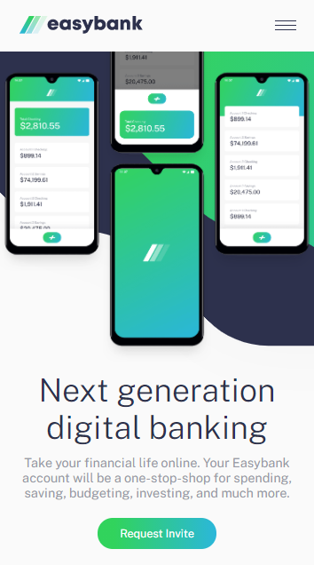
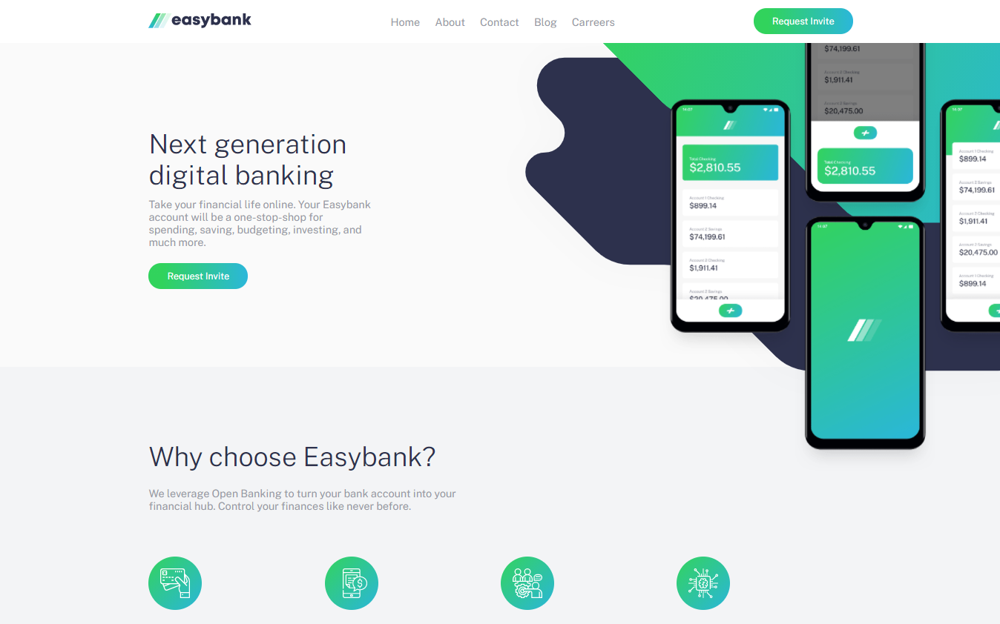

<h1 align="center">
 
  
 
 
Easybank
</h1>

O <i>Easybank</i> é um banco digital fictício. Este projeto foi feito para testar as habilidades de construção de layout, além disso, o projeto é um desafio feito pela [frontendmentor](https://www.frontendmentor.io)

[//]: # (Add your gifs/images here:)

  
  

## Features
[//]: # (Add the features of your project here:)

- ReactJS
- Next.js
- Styled components

## Iniciando

1. Clone o repositório: `git@github.com:Salv-Dev/easybank.git`.
2. Vá para o diretório `cd easybank`.
3. Rode `npm i` para instalar as dependências.
4. Rode `npm run dev` para iniciar o projeto em modo desenvolvedor.
5. Caso queira rodar  no modo produção, rode `npm run build` e depois `npm start`.

